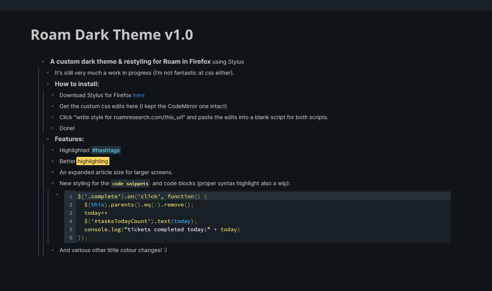

# Roam_Darktheme
A dark theme for Roam Research 

This is a custom theme for Roam that edits some parts of the basic layout and colouration. 

# Installation: 
1. Download [Stylus](https://addons.mozilla.org/en-GB/firefox/addon/styl-us/) for Firefox.
2. Create two blank stylesheets with the roamresearch.com url (make sure to remove everything past the .com).
3. Copypaste the customcss & codemirror styelsheets into each script.
4. It should automatically apply. 

If you want to change the css in any way, my edits are commented to indicate what does what.

